# WVHS Regional Telehealth Network

### Western Victoria Health Services — Multi-Site Healthcare Network Design & Implementation

[](https://www.netacad.com/courses/packet-tracer)

[](#️-network-architecture)

[](#-ip-addressing-scheme-vlsm)

[](#-security-implementation)

[](#-connectivity-verification--1010-tests-passed)

[](#project-overview)
---
> End-to-end enterprise healthcare network designed and implemented in Cisco Packet Tracer for NIT1104 Computer Networks.

## Project Overview

This project designs and implements a **secure, multi-site regional telehealth network** for Western Victoria Health Services (WVHS), connecting three geographically dispersed medical facilities across regional Victoria, Australia.

**Before this network:** Three clinics operated in complete isolation. Specialist consultations required days-long waits. Diagnostic imaging was transported by courier. Patient safety was at risk.

**After this network:** Same-day specialist consultations via telehealth. Real-time radiologist access to diagnostic imaging. Centralised electronic health records. Secure, scalable infrastructure.

---

## Executive Summary

The network design adopts a hub-and-spoke topology with Ballarat as the central hub connected to both remote clinics via dedicated serial WAN links. Variable Length Subnet Masking (VLSM) was applied across the assigned Group 9 base network 10.7.9.0/24, allocating appropriately sized subnets to each department based on current device counts and approximately 30% future growth capacity. Larger departments received /28 subnets providing 14 usable host addresses while smaller departments and WAN links received /29 and /30 subnets respectively which minimizes address wastage across the constrained /24 allocation.

At Ballarat, VLAN segmentation across four VLANs (VLAN 10 through 40) provides Layer 2 department isolation which was implemented through a router-on-a-stick configuration on the Cisco 2911 router. Static routing was selected for inter-site communication given the small, fixed and predictable three-site topology where dynamic routing protocol overhead would be unnecessary. Three Cisco 2911 routers and nine Cisco 2960 switches were deployed across all sites.


Security was a central design priority given the sensitivity of patient health information. Key security controls implemented include encrypted device passwords, service password-encryption, console and VTY line security, MOTD warning banners, unused switch port shutdown across all nine switches and an ACL preventing the Administration subnet from accessing the Radiology imaging systems. VLAN segmentation further enforces departmental isolation at Layer 2.


Several technical issues were encountered and resolved during the implementation including router interface naming inconsistencies, serial WAN link clock rate configuration, VLAN sub interface IP overlap errors and switch management IP conflicts. All ten connectivity tests passed successfully, confirming full end-to-end reachability across all three sites and correct ACL enforcement. The completed network enables same-day specialist consultations, immediate radiologist access to diagnostic imaging and coordinated electronic health record access across the region.


## Table of Contents

- [Network Architecture](#️-network-architecture)
- [IP Addressing Scheme](#-ip-addressing-scheme-vlsm)
- [VLAN Design](#-vlan-design-ballarat-hub)
- [Routing Design](#️-routing-design)
- [Security Implementation](#-security-implementation)
- [Connectivity Verification](#-connectivity-verification--1010-tests-passed)
- [Troubleshooting Log](#-troubleshooting-log)
- [Technologies Used](#technologies-used)
- [Lessons Learned](#lessons-learned)
- 
## 🗺️ Network Architecture

```
                    ┌───────────────────────────────────┐
                    │     BALLARAT (Central Hub)        │
                    │                                   │
                    │  VLAN 10 │ Radiology  10.7.9.0/28 │
                    │ VLAN 20 │ Cardiology 10.7.9.16/29 │
                    │ VLAN 30 │ Admin      10.7.9.32/28 │
                    │ VLAN 40 │ IT Infra   10.7.9.48/29 │
                    │                                   │
                    │         [R-Ballarat]              │
                    └──────────┬──────────┬─────────────┘
                               │          │
              WAN 10.7.9.112/30│          │WAN 10.7.9.116/30
                               │          │
          ┌────────────────────┘          └──────────────────┐
          │                                                  │
┌─────────▼──────────┐                          ┌────────────▼───────┐
│  ARARAT (Spoke)    │                          │  HORSHAM (Spoke)   │
│                    │                          │                    │
│ Clinical 10.7.9.64/29                         │ Clinical 10.7.9.80/28
│ Reception 10.7.9.72/29                        │ Reception 10.7.9.96/29
│                    │                          │                    │
│    [R-Ararat]      │                          │   [R-Horsham]      │
└────────────────────┘                          └────────────────────┘
```

**Topology:** Hub-and-spoke — all inter-site traffic routes through Ballarat.

## Logical Topology Diagram


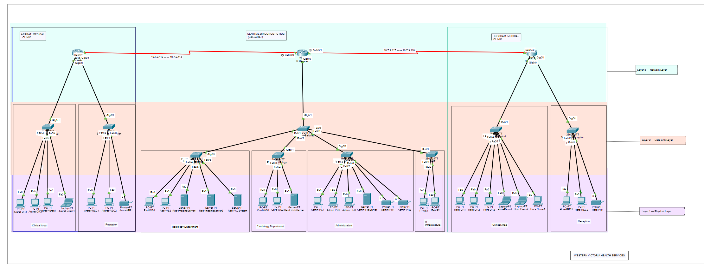
## Physical Site Layouts

### Geographical View 

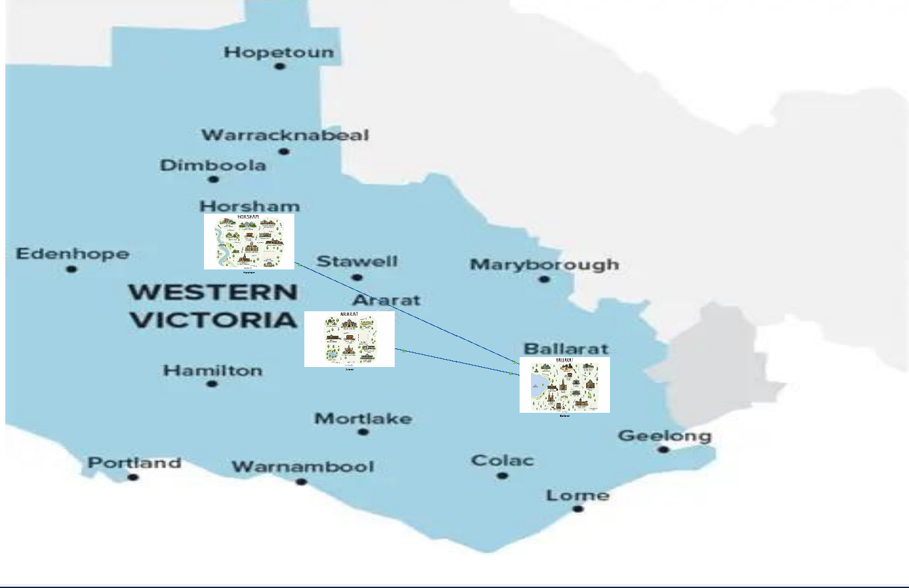

### Ballarat
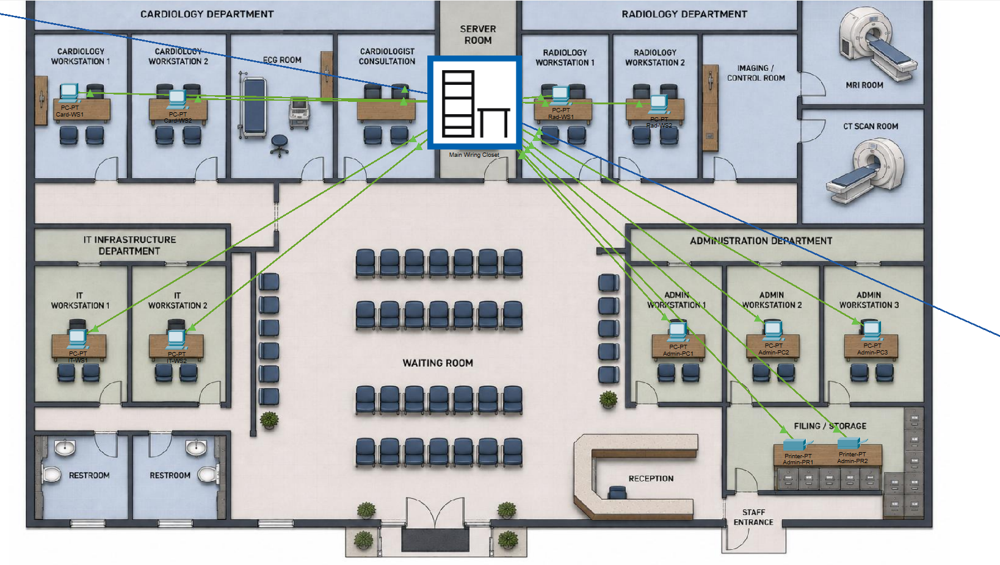

### Ararat

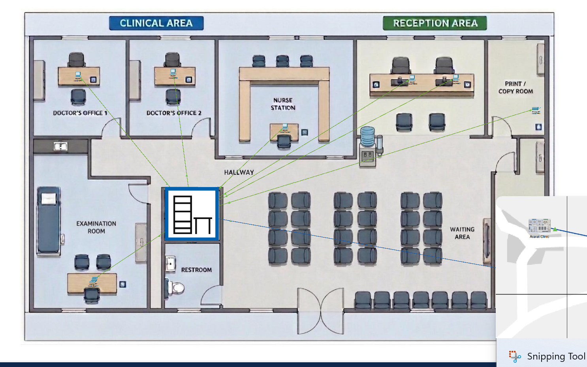

### Horsham
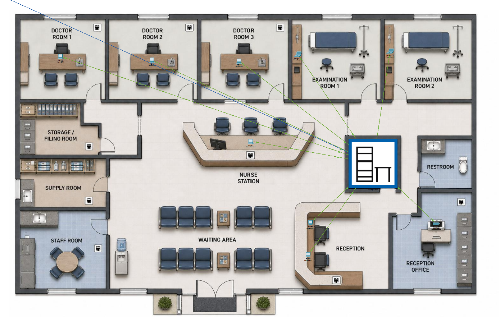

## 📐 IP Addressing Scheme (VLSM)


**Base Network:** `10.7.9.0/24`  
**Method:** Variable Length Subnet Masking (VLSM) — smallest subnet per department with 30% growth capacity

| Subnet                               | Network    | CIDR | Subnet Mask     | Gateway   | Usable Hosts |
|--------------------------------------|------------|------|-----------------|-----------|--------------|
| Site 1 – Radiology (VLAN 10)         | 10.7.9.0   | /28  | 255.255.255.240 | 10.7.9.1  | 14           |
| Site 1 – Cardiology (VLAN 20)        | 10.7.9.16  | /29  | 255.255.255.248 | 10.7.9.17 | 6            |
| Site 1 – Administration (VLAN 30)    | 10.7.9.32  | /28  | 255.255.255.240 | 10.7.9.33 | 14           |
| Site 1 – IT Infrastructure (VLAN 40) | 10.7.9.48  | /29  | 255.255.255.248 | 10.7.9.49 | 6            |
| Site 2 – Ararat Clinical             | 10.7.9.64  | /29  | 255.255.255.248 | 10.7.9.65 | 6            |
| Site 2 – Ararat Reception            | 10.7.9.72  | /29  | 255.255.255.248 | 10.7.9.73 | 6            |
| Site 3 – Horsham Clinical            | 10.7.9.80  | /28  | 255.255.255.240 | 10.7.9.81 | 14           |
| Site 3 – Horsham Reception           | 10.7.9.96  | /29  | 255.255.255.248 | 10.7.9.97 | 6            |
| WAN Ballarat–Ararat                  | 10.7.9.112 | /30  | 255.255.255.252 | N/A       | 2            |
| WAN Ballarat–Horsham                 | 10.7.9.116 | /30  | 255.255.255.252 | N/A       | 2            |

---

## 🔀 VLAN Design (Ballarat Hub)

| VLAN    | Name              | Subnet       | Devices                                             |
|---------|-------------------|--------------|-----------------------------------------------------|
| VLAN 10 | Radiology         | 10.7.9.0/28  | 2× workstations, 2× imaging servers, 1× PACS system |
| VLAN 20 | Cardiology        | 10.7.9.16/29 | 2× specialist workstations, 1× ECG analysis server  |
| VLAN 30 | Administration    | 10.7.9.32/28 | 3× admin PCs, 2× printers, 1× file server           |
| VLAN 40 | IT Infrastructure | 10.7.9.48/29 | 2× network management workstations                  |

**Inter-VLAN Routing:** Router-on-a-stick via R-Ballarat with 802.1Q subinterfaces. Single trunk port connects R-Ballarat to SW-Core-Ballarat carrying all four VLANs.

Ararat and Horsham use physically separated departmental switches connected directly to dedicated router interfaces, so VLAN segmentation was unnecessary at those sites.

---

## 🗺️ Routing Design

**Protocol:** Static routing (no dynamic protocol)

**Why static routing?**

- Fixed, predictable hub-and-spoke topology — routes never change
- No dynamic protocol overhead on WAN serial links
- 100% deterministic paths — critical for healthcare traffic
- Simple to verify and troubleshoot with only 3 routers

| Router     | Directly Connected            | Static Routes To                                                       |
|------------|-------------------------------|------------------------------------------------------------------------|
| R-Ballarat | 6 networks (4 VLANs + 2 WANs) | Ararat Clinical, Ararat Reception, Horsham Clinical, Horsham Reception |
| R-Ararat   | 3 networks (2 LANs + 1 WAN)   | All Ballarat VLANs, Horsham subnets, Ballarat-Horsham WAN              |
| R-Horsham  | 3 networks (2 LANs + 1 WAN)   | All Ballarat VLANs, Ararat subnets, Ballarat-Ararat WAN                |

---

## 🔒 Security Implementation

### 1. Device Hardening (all 12 infrastructure devices)

- Encrypted privileged access (`enable secret` with MD5 hashing)
- `service password-encryption` on all stored passwords
- Console and VTY line authentication
- Legal warning MOTD banners
- Auto-logout after 5 minutes of inactivity

### 2. VLAN Segmentation

- Layer 2 department isolation — Radiology traffic invisible to Admin at switch level
- Reduced broadcast domains per department
- Controlled inter-department traffic flow

### 3. ACL Controls

- **ACL 100** on R-Ballarat — blocks Administration subnet (`10.7.9.32/28`) from accessing Radiology subnet (`10.7.9.0/28`)
- Applied **inbound** on VLAN 30 subinterface (close to source — best practice)
- Implements **least-privilege principle** — admin staff have no clinical need to access patient imaging
- Healthcare compliance aligned (Australian Privacy Act 1988)

### 4. Physical Security

- All unused switch ports administratively shut down across all 9 switches
- Prevents rogue device connection in public clinic areas

---

## 🔧 Device Inventory

| Device            | Hostname         | Role                                    | Site     |
|-------------------|------------------|-----------------------------------------|----------|
| Cisco 2911 Router | R-Ballarat       | Hub router, inter-VLAN routing, WAN hub | Ballarat |
| Cisco 2911 Router | R-Ararat         | Spoke router                            | Ararat   |
| Cisco 2911 Router | R-Horsham        | Spoke router                            | Horsham  |
| Cisco 2960 Switch | SW-Core-Ballarat | Core switch, trunking                   | Ballarat |
| Cisco 2960 Switch | SW-Radiology     | Departmental switch VLAN 10             | Ballarat |
| Cisco 2960 Switch | SW-Cardiology    | Departmental switch VLAN 20             | Ballarat |
| Cisco 2960 Switch | SW-Admin         | Departmental switch VLAN 30             | Ballarat |
| Cisco 2960 Switch | SW-IT            | Departmental switch VLAN 40             | Ballarat |
| Cisco 2960 Switch | SW-Ararat-Clinical   | Clinical switch                             | Ararat   |
| Cisco 2960 Switch | SW-Ararat-Reception   | Reception switch                             | Ararat   |
| Cisco 2960 Switch | SW-Horsham-Clinical  | Clinical switch                             | Horsham  |
| Cisco 2960 Switch | SW-Horsham-Reception  | Reception switch                             | Horsham  |

---

## ✅ Connectivity Verification — 10/10 Tests Passed

| #  | Source                 | Destination               | Test Type               | Result             |
|----|------------------------|---------------------------|-------------------------|--------------------|
| 1  | Radiology workstation  | Radiology server          | Same-VLAN               | ✅ Pass             |
| 2  | Cardiology workstation | Radiology server          | Inter-VLAN (VLAN20→10)  | ✅ Pass             |
| 3  | Admin PC               | Cardiology server         | Inter-VLAN (VLAN30→20)  | ✅ Pass             |
| 4  | Admin PC               | Radiology server          | ACL block test          | ✅ Correctly DENIED |
| 5  | R-Ballarat             | R-Ararat                  | WAN link test           | ✅ Pass             |
| 6  | R-Ballarat             | R-Horsham                 | WAN link test           | ✅ Pass             |
| 7  | Ararat Clinical PC     | Ballarat Radiology server | Cross-site routing      | ✅ Pass             |
| 8  | Horsham Clinical PC    | Ballarat Radiology server | Cross-site routing      | ✅ Pass             |
| 9  | Ararat Clinical PC     | Horsham Clinical PC       | Spoke-to-spoke via hub  | ✅ Pass             |
| 10 | IT workstation         | All subnets               | Network-wide management | ✅ Pass             |

---

## 🔧 Troubleshooting Log

| Issue                         | Symptom                             | Root Cause                                           | Resolution                                             |
|-------------------------------|-------------------------------------|------------------------------------------------------|--------------------------------------------------------|
| Router interface errors       | `Invalid input` on config commands  | Cisco 2911 uses `GigabitEthernet` not `FastEthernet` | Corrected interface naming                             |
| Serial WAN links down         | Links stayed down after cabling     | DCE end missing `clock rate` command                 | Added `clock rate 64000` on DCE serial interfaces      |
| VLAN subinterface IPs failed  | IPs wouldn't apply to subinterfaces | Physical interface had an IP assigned                | Removed physical interface IP with `no ip address`     |
| Switch management IP conflict | Duplicate IP on SW-Core-Ballarat    | Same IP assigned to two devices                      | Reassigned SW-Core-Ballarat management IP to 10.7.9.46 |

---

## 📁 Repository Structure

```
wvhs-telehealth-network/
├── README.md                          ← You are here
├── configs/
│   ├── R-Ballarat/
│   │   └── running-config.txt         ← Full R-Ballarat IOS configuration
│   ├── R-Ararat/
│   │   └── running-config.txt         ← Full R-Ararat IOS configuration
│   ├── R-Horsham/
│   │   └── running-config.txt         ← Full R-Horsham IOS configuration
│   └── switches/
│       ├── SW-Core-Ballarat.txt       ← Core switch configuration
│       ├── SW-Radiology.txt           ← VLAN 10 switch
│       ├── SW-Cardiology.txt          ← VLAN 20 switch
│       ├── SW-Admin.txt               ← VLAN 30 switch
│       ├── SW-IT.txt                  ← VLAN 40 switch
│       ├── SW-Ararat-Clinical.txt     ← Ararat Clinical 
│       ├── SW-Ararat-Reception.txt    ← Ararat Reception 
│       ├── SW-Horsham-Clinical.txt    ← Horsham Clinical 
│       ├── SW-Horsham-Reception.txt   ← Horsham Reception 

├── docs/
│   ├── network-design.md              ← Full design rationale document
│   ├── ip-addressing.md               ← VLSM design process and table
│   ├── vlan-design.md                 ← VLAN architecture and rationale
│   ├── routing-design.md              ← Static routing decisions
│   ├── security-design.md             ← Security architecture
│   ├── troubleshooting-log.md         ← Issues encountered and resolutions
│   └── testing-verification.md        ← All connectivity test results
├── diagrams/
│   └── topology-description.md        ← Logical and physical topology docs
└── packet-tracer/
    ├── Group9_NIT1104_Assessment3.pkt
    └── README.md                      ← Instructions for opening .pkt file

```

---

## 🚀 How to Open in Cisco Packet Tracer

1. Download and install [Cisco Packet Tracer](https://www.netacad.com/courses/packet-tracer) (free with NetAcad account)
2. Clone this repository: `git clone https://github.com/YOUR-USERNAME/wvhs-telehealth-network.git`
3. Open `packet-tracer/Group9_NIT1104_Assesment3.pkt` in Packet Tracer
4. Use **Simulation Mode** to trace packet flows between sites
5. Open any device CLI and run `show ip route` or `show vlan brief` to inspect configurations

---
## Technologies Used

- Cisco Packet Tracer
- Cisco 2911 Routers
- Cisco 2960 Switches
- IPv4 Addressing
- VLSM Subnetting
- VLAN Segmentation
- 802.1Q Trunking
- Router-on-a-Stick
- Static Routing
- Extended ACLs
- Serial WAN Configuration
- Network Troubleshooting

## 💡 Key Technical Skills Demonstrated

| Skill                         | Implementation                                                             |
|-------------------------------|----------------------------------------------------------------------------|
| **VLSM Subnetting**           | 10 subnets sized precisely from a single /24 base network                  |
| **VLAN Design**               | 4-VLAN segmentation at Ballarat hub with 802.1Q trunking 
| **Router-on-a-Stick**         | Inter-VLAN routing via subinterfaces on Cisco 2911                         |
| **Static Routing**            | Full multi-site routing table across 3 routers                             |
| **Extended ACLs**             | Layer 3 packet filtering with wildcard masks                               |
| **Device Hardening**          | enable secret, service password-encryption, line authentication, MOTD      |
| **WAN Configuration**         | Serial DCE/DTE links with clock rate, point-to-point /30 subnets           |
| **Network Troubleshooting**   | OSI layer-by-layer methodology, 4 real issues resolved                     |
| **Healthcare Network Design** | Least-privilege security, departmental isolation, fault tolerance planning |

---

## CLI Verification Evidence

### 1. Routing Table Verification
#### Ballarat Routing Table
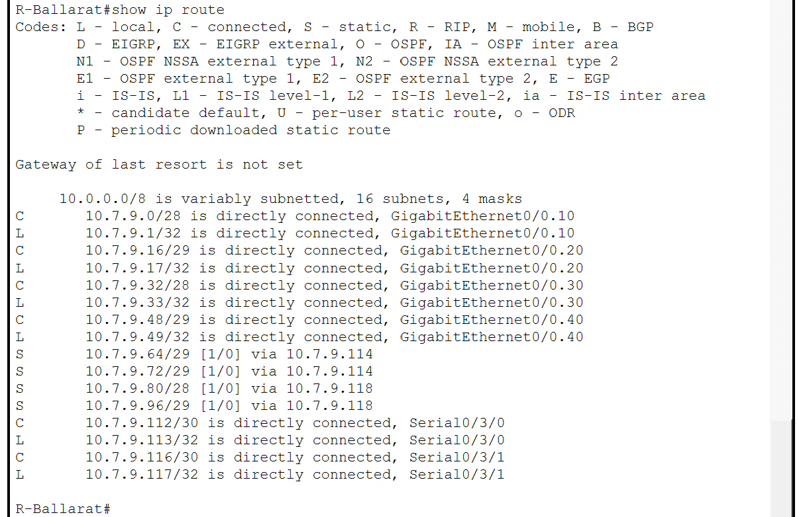

#### Ararat Routing Table
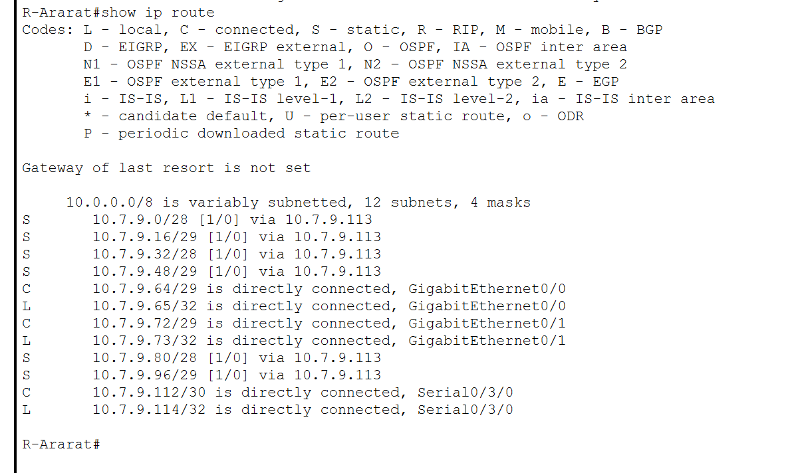

#### Horsham Routing Table
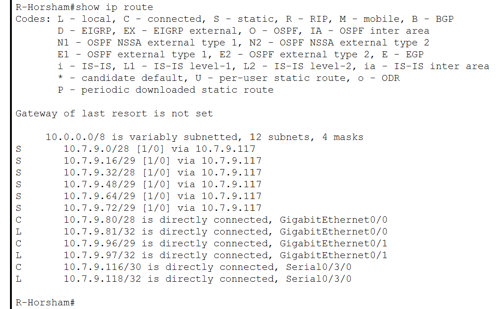

### 2. VLAN Verification
#### Ballarat-Core-Switch VLAN Verification 
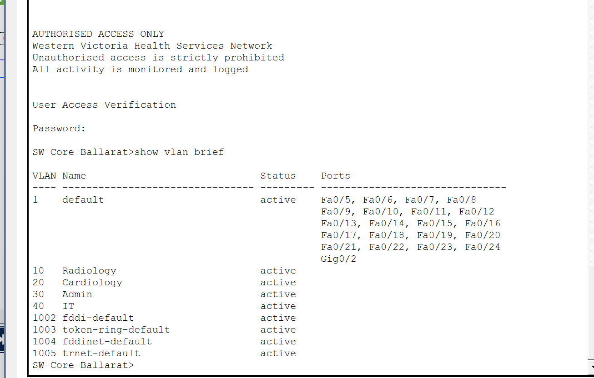

### 3. Cross-Site Connectivity Test
#### Horsham to Ararat 
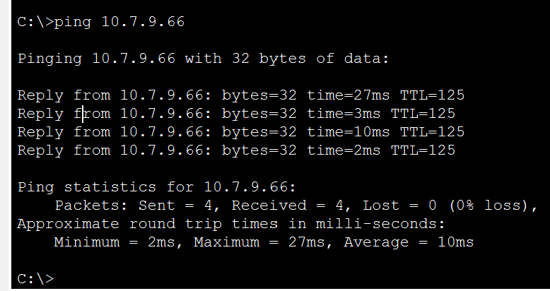
#### Ararat to Imaging Server(Ballarat)
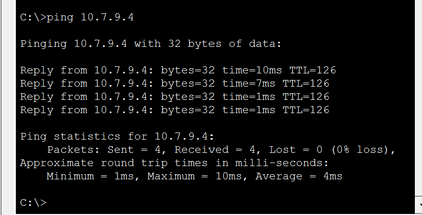

### 4. ACL-Test
#### Admin to Radiology 
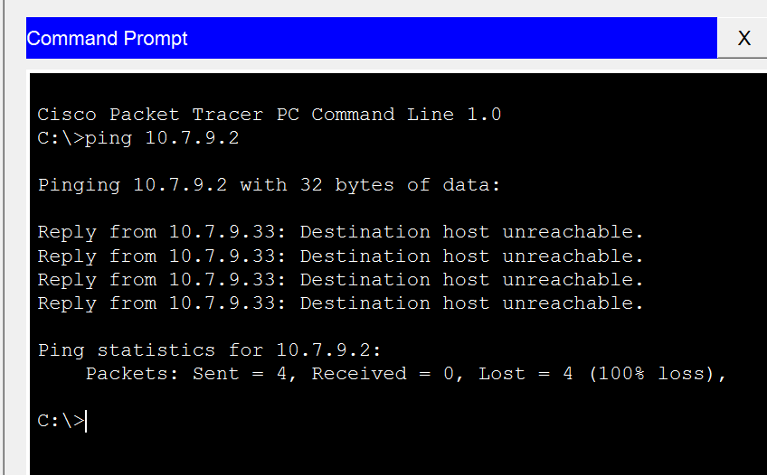


## Bandwidth and Performance Considerations

Healthcare networks require high-performance data transfer to support diagnostic imaging, PACS systems, telehealth video, and electronic medical records. Typical bandwidth requirements for the WVHS network include CT scan series of 100 to 500 MB per study, X-ray series of 10 to 50 MB, and real-time telehealth video requiring a minimum sustained throughput of 1 to 2 Mbps per active consultation session.

The hub-and-spoke design centralises imaging resources at Ballarat allowing remote clinic doctors and specialists to access the PACS system and imaging servers directly over the WAN links without requiring local imaging infrastructure. The serial WAN links in Packet Tracer simulate dedicated leased-line WAN connections used in real enterprise environments without contention from shared internet traffic, essential for reliable transfer of large DICOM imaging files. VLAN segmentation at Ballarat improves LAN performance by containing broadcast domains within each department. In a production deployment, Quality of Service policies on WAN-facing interfaces would prioritise real-time telehealth video above bulk imaging transfers and administrative traffic.

## Redundancy and Fault Tolerance

The current implementation contains several single points of failure acknowledged as limitations of the prototype scope. R-Ballarat is the primary single point of failure which means its failure would stop all inter-site communication and inter-VLAN routing. WAN serial link failure would isolate the affected remote clinic. SW-Core-Ballarat failure would isolate all Ballarat departments from each other and from the WAN.

In a production healthcare environment these risks would be mitigated through redundant routers at Ballarat in HSRP hot-standby configuration, dual WAN connections from each remote clinic using floating static routes as automatic failover, redundant core switches with EtherChannel uplinks, and Spanning Tree Protocol across all switching infrastructure. Dedicated departmental switches already improve access-layer fault isolation while a switch failure only impacts one department. Remote clinics should maintain local contingency procedures for WAN outages including cached patient records and protocols for deferring non-urgent imaging.

## Project Outcomes

This project significantly improved understanding of real-world network design principles including subnet planning, VLAN segmentation, static routing, WAN implementation and layered security controls. The implementation process highlighted the importance of structured troubleshooting methodologies, accurate IP planning and understanding how Layer 2 and Layer 3 technologies interact in enterprise environments.

The project also reinforced the importance of designing networks around business requirements rather than purely technical requirements. In healthcare environments, network reliability, security and low-latency access to patient information directly affect operational efficiency and patient outcomes.

## Future Improvements

Potential future enhancements for a production deployment include:

- Dynamic routing implementation using OSPF
- QoS policies for telehealth voice/video prioritisation
- VPN encryption across WAN links
- DHCP centralisation
- Redundant WAN failover links
- HSRP gateway redundancy at Ballarat
- Centralised syslog and SNMP monitoring
- IPv6 dual-stack deployment

## 📄 License

This project is for educational and portfolio purposes. Network configurations and design documentation are original work by Group 9, NIT1104.
